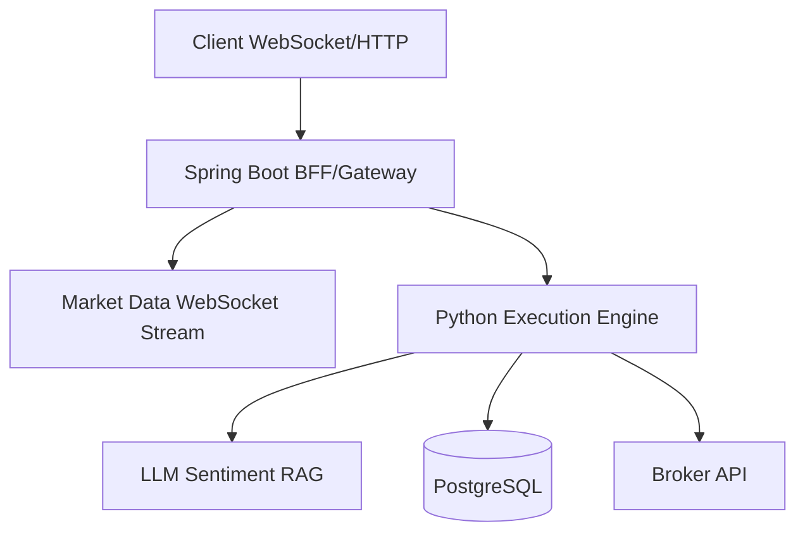

# Architectural Overview

TradeBot V2 operates in a high-frequency, data-intensive environment where market ticks must be processed in milliseconds while simultaneously executing complex ML inference. A monolithic approach proved insufficient, leading us to a polyglot microservices architecture.

# Polyglot Decision: Spring Boot & Python

We explicitly chose to split the system based on workload characteristics:

1. **Spring Boot (Gateway / BFF):** Handles the high-throughput, concurrent I/O required for the client-facing APIs and WebSocket market data streams. The JVM's mature threading models and non-blocking I/O (via Spring WebFlux) are perfectly suited for maintaining thousands of active connections.
2. **Python (Execution Engine):** The core trading logic, ML-driven strategy selection, and LLM-powered sentiment analysis (using LangChain and Scikit-learn) live here. Python is the undisputed king of data science, allowing rapid iteration on quantitative models. 

# Handling WebSocket Backpressure

One of the most complex challenges was handling market data bursts. During extreme volatility, the inbound tick rate can easily overwhelm the client or the internal processing pipelines.

We implemented a reactive backpressure strategy in the Spring Boot Gateway:

1. **Conflation:** Instead of blindly forwarding every tick, the gateway conflates updates. If a client is slow, the gateway only sends the *latest* price snapshot for a given symbol, dropping intermediate ticks that are no longer relevant.
2. **Reactive Streams:** We utilized Project Reactor. When the downstream buffer fills up, the framework automatically signals upstream to slow down, preventing OutOfMemory errors and maintaining system stability.

This deliberate architectural split and robust backpressure handling ensures TradeBot V2 remains responsive and accurate even during market turbulence.
